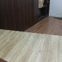
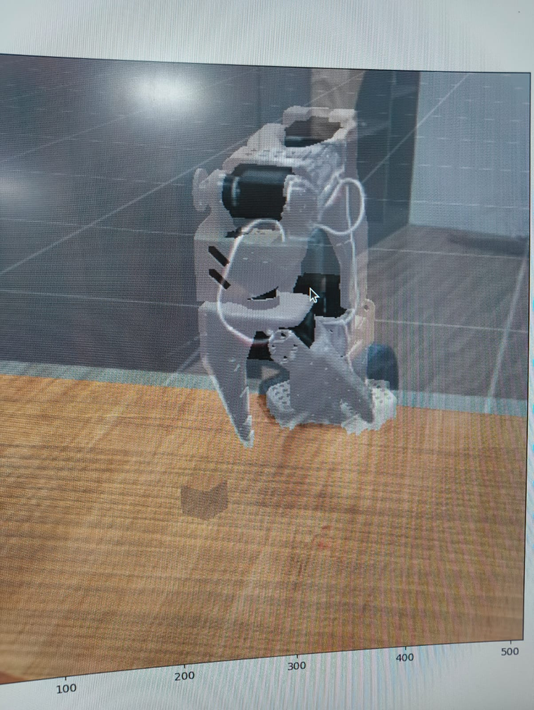
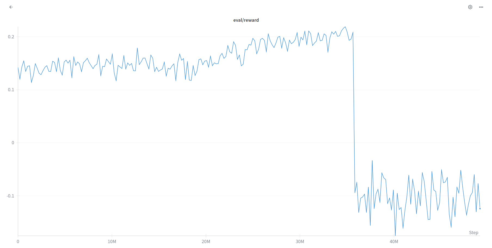

# FPO Sim2Real Guide: Advanced Flow Policy Optimization for LeRobot

Welcome to our comprehensive guide on Flow Policy Optimization (FPO) for sim2real transfer with LeRobot! This tutorial builds upon our [zero-shot RGB sim2real approach](zero_shot_rgb_sim2real.md) and introduces FPO - a more advanced reinforcement learning method that often achieves better sample efficiency and more robust policies for real-world deployment.

FPO (Flow Policy Optimization) is an enhanced version of PPO that uses flow-based policy updates for more stable and efficient learning. If you're new to sim2real with LeRobot, we strongly recommend starting with the [basic zero-shot RGB tutorial](zero_shot_rgb_sim2real.md) first.

If you find this project useful, give this repo and [ManiSkill](https://github.com/haosulab/ManiSkill) a star! If you are using [SO100](https://github.com/TheRobotStudio/SO-ARM100/)/[LeRobot](https://github.com/huggingface/lerobot), make sure to also give them a star.

This tutorial was written for researchers and practitioners working on advanced robotic manipulation with sim2real transfer.

## Prerequisites

Before starting this tutorial, ensure you have:
- Completed the [zero-shot RGB sim2real tutorial](zero_shot_rgb_sim2real.md) setup steps 0-1.3
- Python environment with LeRobot and ManiSkill installed
- UV package manager for dependency management
- NVIDIA GPU with at least 8GB memory
- SO100 robot hardware properly calibrated
- Camera alignment completed from the basic tutorial

## Environment Setup with UV

This project uses UV for fast and reliable Python package management. UV provides deterministic builds and faster dependency resolution compared to traditional pip.

### Installing UV
```bash
# Install UV package manager
curl -LsSf https://astral.sh/uv/install.sh | sh
```

### Dependency Management
```bash
# Lock dependencies (creates uv.lock file with exact versions)
uv lock

# Sync environment with locked dependencies
uv sync

# Activate the virtual environment
source .venv/bin/activate  # Linux/Mac
# or
.venv\Scripts\activate     # Windows
```

**Why UV Lock and Sync?**
- `uv lock` creates a lock file that pins exact versions of all dependencies and their sub-dependencies
- `uv sync` installs exactly those locked versions, ensuring reproducible environments
- This prevents version conflicts and "works on my machine" issues
- Critical for research reproducibility and team collaboration

## Camera Alignment and Greenscreen Setup

Since you've completed the [zero-shot RGB tutorial](zero_shot_rgb_sim2real.md), you should already have:
- Camera positioned and aligned (Section 1.2 of zero-shot guide)
- Background greenscreen image captured (Section 1.3 of zero-shot guide)  
- `env_config.json` properly configured with greenscreen path


<p align="center">
  
  <br>
  <em>Example greenscreen</em>
</p>


<p align="center">
  
  <br>
  <em>Example Camera Alignment </em>
</p>

If you need to revisit these steps, refer to sections 1.1-1.3 of the [zero-shot RGB sim2real guide](zero_shot_rgb_sim2real.md).


## FPO Algorithm Overview

Flow Policy Optimization (FPO) enhances standard PPO with:
- **Flow-based policy updates** for smoother gradient flows
- **Improved sample efficiency** through better experience utilization  
- **Enhanced stability** during training with flow regularization
- **Better sim2real transfer** due to more robust learned representations

### Key Differences from PPO:
1. **Flow Steps**: FPO uses multiple flow steps (`fpo-num-steps`) to refine policy updates
2. **Sample Reuse**: Better utilization of collected samples (`fpo-num-train-samples`)
3. **Log Ratio Clipping**: Enhanced clipping mechanism (`fpo-logratio-clip`)
4. **Gradient Flow**: More stable gradient updates through flow-based optimization

## Training FPO Agent

### Quick Start
Make the training script executable and run:
```bash
chmod +x fpo_run.sh
./fpo_run.sh
```

### Detailed FPO Training Command
```bash
seed=3
python lerobot_sim2real/scripts/train_fpo_rgb.py --env-id="SO100GraspCube-v1" --env-kwargs-json-path=env_config.json \
       --ppo.seed=${seed} \
       --ppo.num_envs=256 --ppo.num-steps=32 --ppo.update_epochs=2 --ppo.num_minibatches=8 \
       --ppo.total_timesteps=50_000_000 --ppo.gamma=0.95 --ppo.gae-lambda=0.95 \
       --ppo.learning-rate=1e-5 --ppo.reward-scale=1.0 \
       --ppo.num_eval_envs=16 --ppo.num-eval-steps=64 --ppo.no-partial-reset \
       --ppo.fpo-num-steps=6 --ppo.fpo-num-train-samples=8 --ppo.fpo-logratio-clip=0.5 \
       --ppo.clip-coef=0.15 --ppo.max-grad-norm=2.0 --ppo.target-kl=0.005 \
       --ppo.vf-coef=1.0 --ppo.ent-coef=0.00 \
       --ppo.exp-name="fpo-SO100GraspCube-v1-${seed}" \
       --ppo.track --ppo.wandb_project_name "SO100-ManiSkill"
```


## Critical Hyperparameters Explained

### FPO-Specific Parameters

#### `--ppo.fpo-num-steps=6`
**What it does:** Number of flow optimization steps per policy update  
**Why it matters:** More steps = smoother policy updates but slower training  
**Tuning advice:** Start with 6, increase to 8-10 for better stability, decrease to 4 for faster training

#### `--ppo.fpo-num-train-samples=8` 
**What it does:** Number of samples used in each flow step  
**Why it matters:** Controls sample efficiency and computational cost  
**Tuning advice:** Higher values (16-32) for complex tasks, lower (4-6) for simple tasks

#### `--ppo.fpo-logratio-clip=0.5`
**What it does:** Clipping threshold for log probability ratios in flow updates  
**Why it matters:** Prevents excessive policy changes, maintains training stability  
**Tuning advice:** Lower values (0.3) for conservative updates, higher (0.7) for faster learning

### Core RL Parameters

#### `--ppo.num_envs=256`
**What it does:** Number of parallel simulation environments  
**Memory impact:** Higher = more GPU memory usage  
**Performance impact:** More environments = faster data collection, more stable gradients  
**Tuning advice:** Use 256-512 for 8GB GPUs, 1024-2048 for 16GB+ GPUs

#### `--ppo.learning-rate=1e-5`
**What it does:** Step size for neural network updates  
**Why FPO uses lower rates:** Flow optimization allows for more conservative learning rates  
**Tuning advice:** Start with 1e-5, increase to 3e-5 if learning is slow, decrease to 5e-6 if unstable

#### `--ppo.gamma=0.95`
**What it does:** Discount factor for future rewards  
**Why 0.95:** Good balance for manipulation tasks (not too short-sighted, not too far-sighted)  
**Tuning advice:** Use 0.9-0.99 range, higher for tasks requiring long-term planning

#### `--ppo.clip-coef=0.15`
**What it does:** PPO clipping parameter for policy updates  
**FPO difference:** Lower than standard PPO (usually 0.2) due to flow regularization  
**Tuning advice:** Decrease if training unstable, increase if learning too conservative

### Training Efficiency Parameters

#### `--ppo.total_timesteps=50_000_000`
**Training time:** ~2-3 hours on RTX 4090  
**When to stop:** Policy should achieve >80% success rate in simulation  
**Early stopping:** Monitor evaluation curves, successful policies often emerge at 25-40M timesteps

#### `--ppo.target-kl=0.005`
**What it does:** Target KL divergence for early stopping policy updates  
**Why conservative:** Prevents policy collapse in FPO  
**Tuning advice:** Increase to 0.01 if updates stop too early, decrease to 0.003 for more conservative training

## Monitoring Training Progress

### TensorBoard Visualization
```bash
tensorboard --logdir runs/
```

### Key Metrics to Watch
1. **Evaluation Success Rate**: Should reach >80% for reliable real-world transfer
2. **Evaluation Return**: Should increase steadily and plateau
3. **Policy Loss**: Should decrease initially then stabilize  
4. **Value Loss**: Should trend downward
5. **KL Divergence**: Should stay below target-kl threshold

### Expected Training Curves
FPO typically shows:
- **Smoother learning curves** compared to standard PPO
- **More stable convergence** with fewer oscillations
- **Better sample efficiency** reaching high performance faster
- **Lower variance** in evaluation metrics



## Real World Deployment

### Evaluation Script
```bash
python lerobot_sim2real/scripts/eval_fpo_rgb.py --env_id="SO100GraspCube-v1" --env-kwargs-json-path=env_config.json \
    --checkpoint=path/to/ckpt.pt --no-continuous-eval --control-freq=15
```
For safety reasons we recommend you run the script above with --no-continuous-eval first, which forces the robot to wait for you to press enter into the command line before it takes each action.


<p align="center">
  
  <br>
  <em>FPO on hardware</em>
</p>


## Frequently Asked Questions

### **Q: Training crashes with "CUDA out of memory" error**
**A:** Reduce these parameters in order:
1. `--ppo.num_envs=128` (halve the environments)
2. `--ppo.fpo-num-train-samples=4` (reduce flow samples)  
3. `--ppo.num-steps=16` (smaller rollout buffer)


### **Q: How do I know if my camera alignment is good enough?**
**A:** Good alignment indicators:
- Robot arms overlay reasonably well between sim and real
- Cube appears in similar positions in both views
- Background features roughly align
- No major rotation or translation offsets

Poor alignment will show obvious mismatches in robot position or severe background differences.

### **Q: FPO converges to suboptimal policy, what should I change?**
**A:** Try these adjustments:
1. **Increase flow steps**: `--ppo.fpo-num-steps=8`
2. **More training samples**: `--ppo.fpo-num-train-samples=16` 
3. **Adjust clipping**: `--ppo.fpo-logratio-clip=0.3` (more conservative)
4. **Lower learning rate**: `--ppo.learning-rate=5e-6`

### **Q: Can I resume FPO training from a checkpoint?**
**A:** Yes, add `--resume-training --checkpoint=path/to/ckpt.pt` to your training command. This is useful for:
- Continuing interrupted training runs
- Fine-tuning with different hyperparameters  
- Extending training duration

### **Q: My real robot calibration seems correct but sim2real still fails**
**A:** Additional troubleshooting:
1. **Check joint limits**: Ensure sim and real robot have same movement constraints
2. **Verify gripper calibration**: Gripper open/close positions must match exactly
3. **Test basic movements**: Use LeRobot's manual control to verify calibration
4. **Camera intrinsics**: Some cameras need FOV adjustments in simulation

## Advanced Hyperparameter Tuning

### For Better Sample Efficiency
```bash
--ppo.fpo-num-steps=8 \
--ppo.fpo-num-train-samples=16 \
--ppo.learning-rate=3e-6 \
--ppo.update_epochs=4
```

### For More Stable Training
```bash
--ppo.fpo-logratio-clip=0.3 \
--ppo.clip-coef=0.1 \
--ppo.target-kl=0.003 \
--ppo.max-grad-norm=1.0
```

### For Faster Training (if you have compute)
```bash
--ppo.num_envs=512 \
--ppo.num-steps=64 \
--ppo.num_minibatches=16 \
--ppo.fpo-num-steps=4
```

## Debugging Common Issues

### Training Not Converging
1. **Check simulation environment**: Run reset distribution video to verify setup
2. **Reward function**: Ensure rewards are properly scaled and shaped
3. **Network architecture**: Default should work, but complex tasks may need larger networks
4. **Hyperparameter search**: Try different combinations systematically

### Real-World Transfer Problems  
1. **Domain gap**: Increase domain randomization in simulation
2. **Lighting differences**: Ensure similar lighting conditions between sim and real
3. **Surface textures**: Check if table/background textures match reasonably
4. **Object properties**: Verify cube size, weight, and material properties

### Performance Optimization
1. **GPU utilization**: Monitor with `nvidia-smi` during training
2. **CPU bottlenecks**: Ensure sufficient CPU cores for parallel environments
3. **Memory usage**: Track memory consumption and adjust batch sizes accordingly


## Next Steps and Extensions

### Improving Your FPO Implementation
1. **Custom reward functions**: Design task-specific rewards
2. **Advanced domain randomization**: Add more visual and physical variations
3. **Multi-task learning**: Train on multiple manipulation tasks simultaneously
4. **Fine-tuning**: Use real-world data to further improve policies


## Troubleshooting Performance Issues

### If Training Takes Too Long
- Reduce `total_timesteps` to 25M for initial experiments
- Increase `num_envs` if you have more GPU memory
- Use fewer `update_epochs` for faster iterations

### If Real-World Performance is Poor
- **Recalibrate robot**: Pay special attention to joint limits and gripper positions
- **Retake greenscreen**: Lighting changes can significantly impact performance  
- **Adjust control frequency**: Try 10 Hz for more conservative movements
- **Check cube properties**: Ensure real cube matches simulation size/weight

## Conclusion

FPO provides a more advanced approach to sim2real transfer with often superior real-world performance compared to standard PPO. The key to success is:

1. **Proper environment setup** (following the zero-shot RGB guide)
2. **Careful hyperparameter tuning** (especially FPO-specific parameters)
3. **Systematic evaluation** (testing multiple checkpoints)
4. **Iterative improvement** (fine-tuning based on real-world results)

The combination of flow-based optimization with the robust sim2real framework provides a powerful foundation for developing real-world robotic manipulation policies. With proper setup and tuning, you should achieve reliable cube grasping performance that transfers well from simulation to reality.

Remember: sim2real is as much art as science - don't be discouraged if your first attempt doesn't work perfectly. The methodology outlined here provides a solid foundation, but every robot setup is unique and may require some experimentation and fine-tuning.